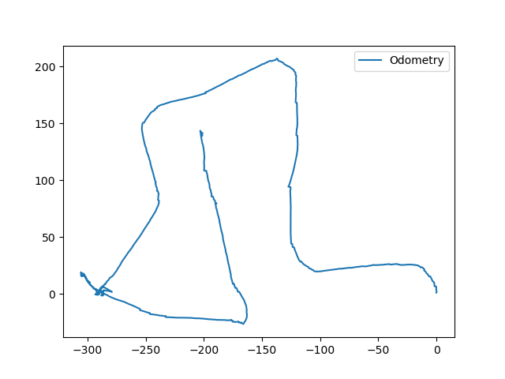
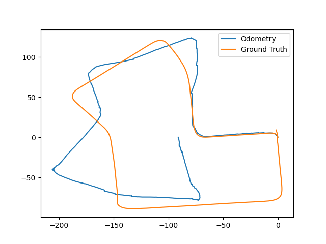
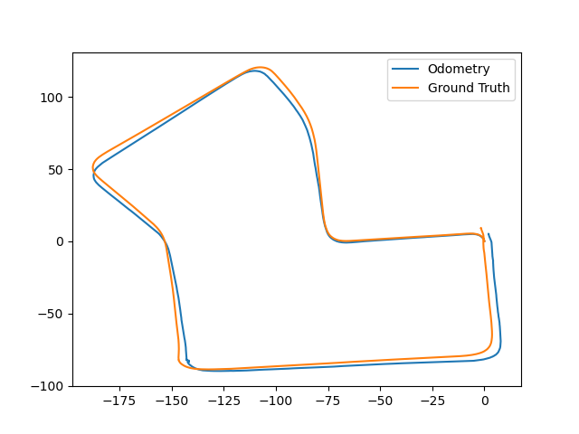

# visual-odometry
Monocular Visual Odometry


## Overview

The repository contains implementation of monocular visual odometry. Repository provides support for live visual odometry using Intel Realsense D435i as well as odometry for recorded images. The sequence of recorded images and corresponding intrinsic matrix have been taken from KITTI Dataset.

The Realsense D435i was caliberated using the method mentioned in the following repository:

https://github.com/Zhefan-Xu/camera-imu-calibration-guide

The example sequence used from KITTI Dataset used: 2011_09_30/2011_09_30_drive_0027_sync/image_02/data/


## Implementation

To run the code live, connect d435i.

```shell
pip install pyrealsense2
python main.py --live --feature_extractor sift
```

To run the code for set of images located in "images: folder:

```shell
python main.py --feature_extractor sift --data_path images/
```


## Sample Results

In the absence of Bundle Adjustment, there appears to be a notable drift in the observed odometry over time. However, the code is capable of identifying accurate local transformations. Notably, SIFT features exhibit superior performance in terms of accuracy, although they are associated with a lengthy computational time, taking approximately five minutes to process a single sequence. Conversely, ORB features offer significantly faster results, completing the same sequence in approximately 42 seconds. However, the downside to this faster processing is that it tends to produce slightly noisier and incorrect local transformation odometry measurements.

* **KITTI Odometry with ORB features without scaling**



* **KITTI Odometry with ORB features with scale correction**



* **KITTI Odometry with SIFT features without scaling**


* **KITTI Odometry with SIFT features with gt scaling**




**Note:** While the code is able to load the live images and compute the odometry by skipping some frames to maintain an optimal speed, Results have not yet been verified on the Realsense D435i pipeline.

